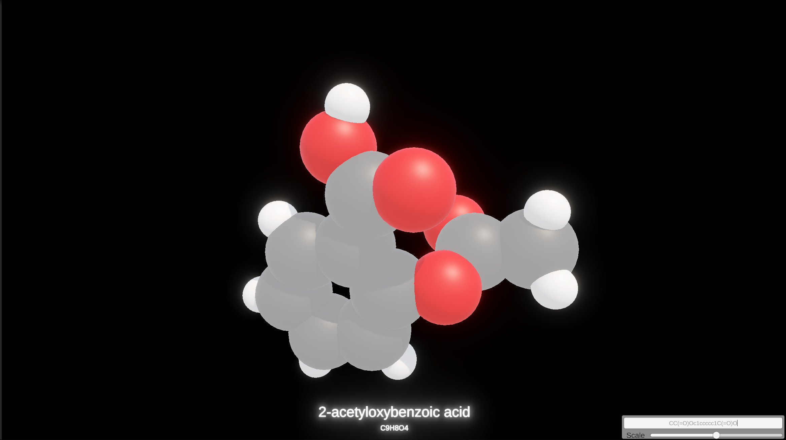
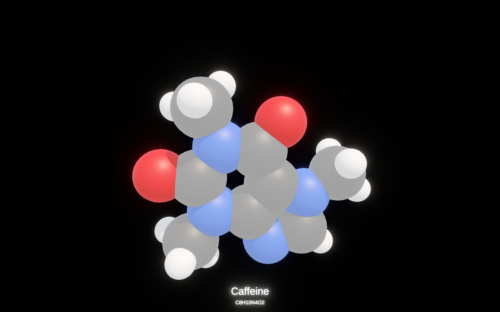
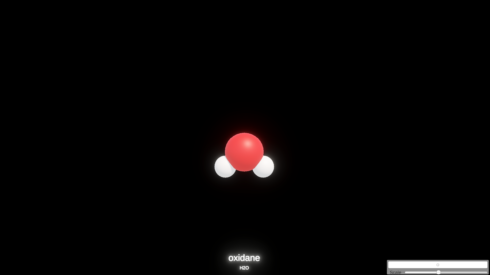
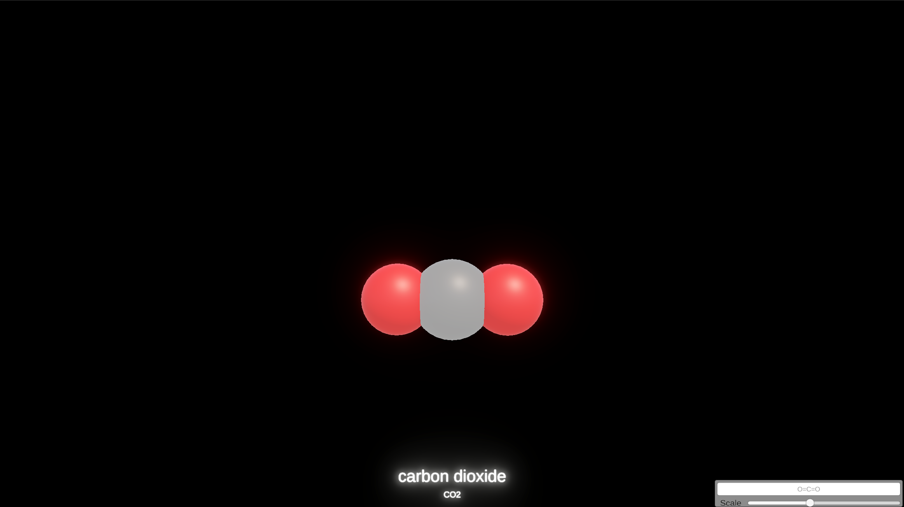

# Molecule Viewer 🔬

Interactive desktop application for visualizing molecular structures in real time using Unity, RDKit, and PubChem.
> This project is a still a Work-In-Progress.

<p align="center">
  
</p>

## Overview

Molecule Viewer is a real-time 3D visualization tool that transforms molecular representations into interactive spatial models.

The project combines cheminformatics tooling with modern rendering techniques to make molecular data more accessible, visually intuitive, and easier to explore.

Given a SMILES string, the application can:

- Generate an interactive 3D molecular structure
- Retrieve molecular metadata from PubChem
- Display molecular formulas and nomenclature
- Render molecules in a real-time 3D environment

---

## Features

### Molecular Visualization

- Interactive 3D molecule rendering
- Sphere-based molecular representation
- Real-time camera controls
- Dynamic molecule generation

### Cheminformatics Integration

- SMILES parsing
- RDKit integration
- Molecular formula extraction
- Molecular structure processing

[RDKit](https://www.rdkit.org/) is used to transform molecular representations into structured chemical data that can be rendered and analyzed within the application.

> ##### Why RDKit?
>
> While PubChem can provide much of the information required for visualization, this project intentionally integrates RDKit to explore real-world cheminformatics workflows. The objective was not simply to render molecules, but to gain experience processing molecular structures using industry-standard chemistry tooling.


### PubChem Integration

- Metadata retrieval
- IUPAC nomenclature retrieval
- Molecular information display

### Performance

- Asynchronous PubChem API requests
- Non-blocking metadata retrieval
- Responsive rendering pipeline

---

## Technology Stack

| Category | Technologies |
|-----------|-------------|
| Engine | Unity |
| Language | C# |
| Cheminformatics | RDKit |
| Data Source | PubChem REST API |
| Runtime | .NET |

---

## Architecture

```text
                User Input
                     │
                     ▼
        ┌─────────────────────┐
        │     SMILES String   │
        └─────────────────────┘
             │           │
             ▼           ▼
         RDKit       PubChem
       Processing     Lookup
             │           │
             ▼           ▼
   Molecular Structure Metadata
              \         /
               \       /
                ▼     ▼
            Unity Renderer
```

The application separates data acquisition, molecular processing, and rendering into independent components, allowing metadata retrieval and molecular generation without blocking the main rendering thread.

---

## Example Workflow

1. Enter a SMILES string.
2. Process molecular data using RDKit and retrieve molecular information from PubChem.
3. Generate a 3D molecular representation.
4. Explore the molecule interactively.

---

## Motivation

I wanted to explore the intersection of cheminformatics and real-time graphics.

Traditional chemistry software often prioritizes functionality over visual presentation. This project explores how modern game-engine technology can be used to create a more engaging and interactive molecular visualization experience.

---

## Gallery
Here are some examples of molecules, taken using the photo mode of Molecule Viewer:
<p align="center">
  
</p>
<p align="center">
  
</p>
<p align="center">
  
</p>

---

## Roadmap

- [X] Common name retrieval
- [X] Photo mode functionality
- [X] Add controls to rotate the molecule.
- [ ] Add controls to zoom in and out.
- [ ] Display a better message when PubChem cannot find the name of a valid SMILES.
- [ ] Add camera stacking to avoid large molecules hiding the molecule name and formula.
- [ ] Additional molecular visualization styles
- [ ] Improved rendering and materials
- [ ] Molecular measurements and annotations
- [X] Replace per-atom GameObjects with mesh batching or GPU instancing for large molecules

---

## Building

```bash
git clone https://github.com/nperreau/MoleculeViewer.git
```

Open the project using the Unity Editor and build normally.

---

## Author

[**Naïl Perreau**](https://nperreau.github.io/)

- LinkedIn: https://www.linkedin.com/in/nailperreau/
- GitHub: https://github.com/nperreau
